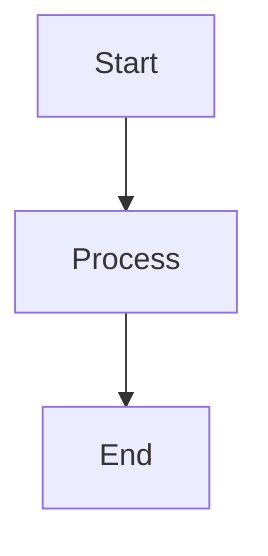

# Markdown Showcase

This file demonstrates many features supported by Markdown and common
extensions used in GitHub and modern renderers.

------------------------------------------------------------------------

## Headings

# H1

## H2

### H3

#### H4

##### H5

###### H6

------------------------------------------------------------------------

## Bold / Italic / Combined

**Bold text**

*Italic text*

***Bold and italic***

------------------------------------------------------------------------

## Strikethrough

~~This text is crossed out~~

------------------------------------------------------------------------

## Inline Code

Use `print("Hello")` in Python.

------------------------------------------------------------------------

## Code Blocks

``` python
def hello():
    print("Hello world")
```

``` javascript
console.log("Hello world")
```

``` html
<h1>Hello World</h1>
```

------------------------------------------------------------------------

## Links

[Open Google](https://www.google.com)

------------------------------------------------------------------------

## Images


------------------------------------------------------------------------

## Blockquote

> Markdown is intended to be easy to read and write.
>
> --- John Gruber

------------------------------------------------------------------------

## Horizontal Rule

------------------------------------------------------------------------

------------------------------------------------------------------------

## Lists

### Unordered

-   Item A
-   Item B
    -   Nested Item
    -   Another nested item

### Ordered

1.  First
2.  Second
3.  Third

------------------------------------------------------------------------

## Task Lists

-   [x] Completed task
-   [ ] Pending task
-   [ ] Another task

------------------------------------------------------------------------

## Tables

| Name       | Language      | Created |
|------------|---------------|---------|
| Python     | Programming   | 1991    |
| Markdown   | Markup        | 2004    |
| HTML       | Markup        | 1993    |

------------------------------------------------------------------------

## Tables with Alignment

| Name       | Language      | Created |
|:-----------|:-------------:|--------:|
| Python     | Programming   | 1991    |
| Markdown   | Markup        | 2004    |
| HTML       | Markup        | 1993    |

------------------------------------------------------------------------

## Footnotes

Here is a sentence with a footnote.[^1]

------------------------------------------------------------------------

## Keyboard Keys

Press <kbd>Ctrl</kbd> + <kbd>S</kbd> to save.

------------------------------------------------------------------------

## Superscript / Subscript

H<sub>2</sub>O

x<sup>2</sup>

------------------------------------------------------------------------

## Emojis

:rocket: :fire: :smile: :white_check_mark:

------------------------------------------------------------------------

## Escaping Characters

\*This is not italic\*

------------------------------------------------------------------------

## Badges


------------------------------------------------------------------------

## Collapsible Section

<details>

<summary>Click to expand</summary>

Hidden content inside a collapsible block.

-   Item 1
-   Item 2
-   Item 3

</details>

------------------------------------------------------------------------

## HTML Inside Markdown

::: {style="color: red;"}
This text is styled using HTML.
:::

------------------------------------------------------------------------

## Mermaid Diagram (GitHub Supported)



------------------------------------------------------------------------

## Math (LaTeX)

Inline math: $E = mc^2$

Block math:

$$
\int_0^1 x^2 dx
$$

$$
\frac{-b \pm \sqrt{b^2 - 4ac}}{2a}
$$

------------------------------------------------------------------------

## Definition List

Term 1
: Definition for term 1

Term 1
:   Definition for term 1


------------------------------------------------------------------------

## Reference Mention

@guisaldanha

------------------------------------------------------------------------

## End

This file can be used to test Markdown renderers such as **MDViewer**.

[^1]: This is the footnote content.
